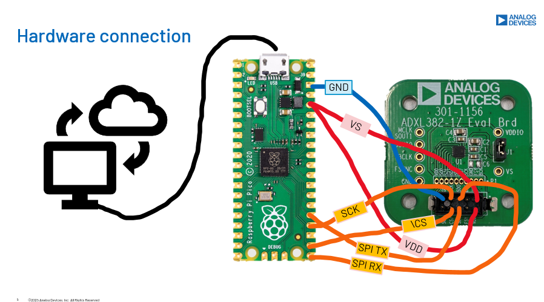

This is the C driver code for ADXL382 sensor. The MCU used is raspberry pi pico. Data communication is done via SPI.
The python file to read sensor data through serial USB and display data on GUI. GUI software can be found in this repo https://github.com/dauhoangganh/ADXL382_Pico_Streamlit_Example
In the main.c, ADXL382 is set up to operate in High performance mode, 8kHz bandwidth and sampling rate (output data rate) at 16KHz.

# Connect Pico to ADXL382
GPIO 16 (pin 21) MISO/spi0_rx-> SDO/SDO on adxl382 board   
GPIO 17 (pin 22) Chip select -> CSB/!CS on adxl382 board  
GPIO 18 (pin 24) SCK/spi0_sclk -> SCL/SCK on adxl382 board  
GPIO 19 (pin 25) MOSI/spi0_tx -> SDA/SDI on adxl382 board  
3.3v (pin 36) -> VS & VDDIO pin on adxl382 board  
GND (pin 38)  -> GND on adxl382 board  

# Deploy the binary file main.uf2 to Pico
1. Open VScode
2. Install raspberry pi pico extension
3. Clone this repo to your pc
4. In VScode raspberry pico windows, import this github project
5. Plug the micro-usb cable to Pico while pressing the BOOTSEL button, this sets the pico in bootsel mode
6. Click run button at the bottom right corner of vs code to flash the main.uf2 file to pico

# Run pico and read sensor data
If you want to see the data on TeraTerm:
1. comment out line 143-149 and 286-292 in main.c (these line are needed when using the associated GUI)
2. Plug the micro-usb cable to Pico while pressing the BOOTSEL button, this sets the pico in bootsel mode
3. Click run button at the bottom right corner of vs code to flash the main.uf2 file to pico
4. Unplug and plug the cable to pico again
5. Open Tera Term and set up COM port
6. See the data printed on teraterm

If you want to use the GUI to see data
1. Flash the original main.c in this git repo to pico
2. Go to this link and follow the instruction
 https://github.com/dauhoangganh/ADXL382_Pico_Streamlit_Example

# Note when using ADXL382 (these info is not written in the datasheet)
1. All register read and write transaction must be done before a new sample is written into FIFO otherwise that sample will lost. 

2. After burst reading FIFO data in FIFO stream mode, FIFO_mode shoud be set to 0 then set again to stream mode to avoid misalignment between read pointer and write pointer.

